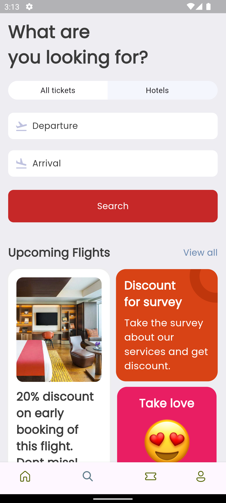
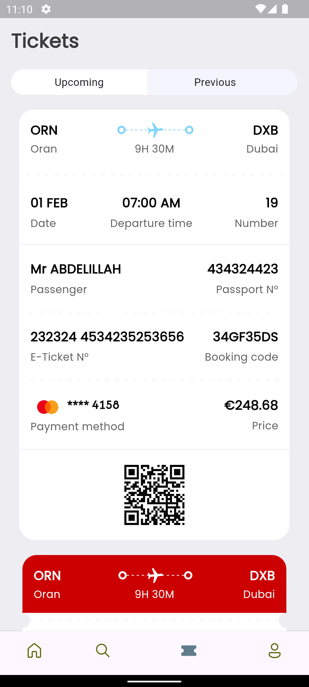

# ✈️ FlightBook: Simple Ticket Booking App

## Overview

FlightBook is a user-friendly Flutter mobile application designed for booking flight tickets effortlessly.

## Features

### Flight Search

- [x] Search flights between cities
- [ ] Select departure and return dates
- [x] View available flights

### Seat Selection

- [ ] Choose seat preferences
- [x] View seat availability

### Booking Process

- [ ] Quick ticket reservation
- [x] Basic payment integration
- [x] Booking confirmation

## Tech Stack

- Flutter 3.x
- Dart

## Screenshots

<table>
  <tr>
    <td> </td>
    <td></td>
     <td> </td>
    <td> </td>
  </tr>

</table>

## Getting Started

### Prerequisites

- Flutter & Dart SDK
- Android Studio / VS Code with Flutter & Dart Plugins installed
